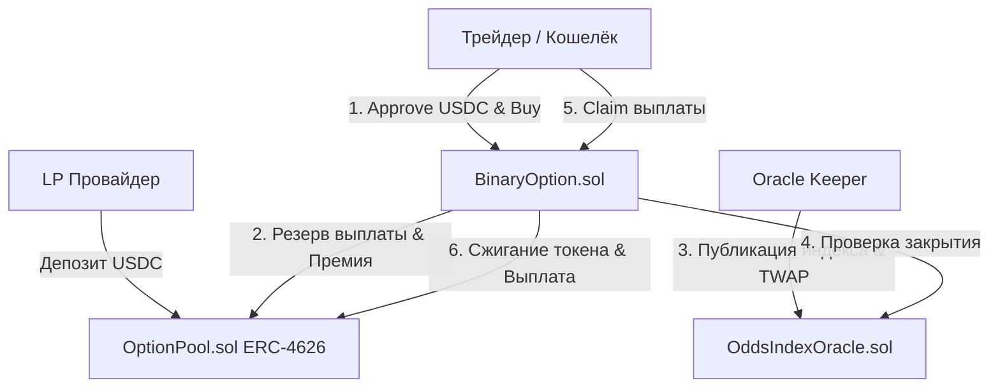

# Chronicle — On-Chain Odds Derivatives Platform

> **Презентация протокола ончейн-деривативов на вероятности событий**

---

## 📍 Слайд 1: Обзор проекта Chronicle

### Что такое Chronicle?
**Chronicle** — это рабочий прототип ончейн-рынка опционов, позволяющий трейдерам торговать не просто исходом события, а **динамикой изменения вероятностей** в режиме реального времени.

- 🎯 **Главная идея:** Переход от бинарного беттинга к структурированным финансовым деривативам на вероятность.
- ⚡ **Механика:** Бинарные опционы `ABOVE` / `BELOW` с фиксированным риском и заранее известной максимальной выплатой.
- 🛡️ **Гарантия выплат:** ERC-4626 пул андеррайтинга с автоматическим резервированием ликвидности.
- 📊 **Оракул цен:** Append-only индекс вероятности с поддержкой TWAP (Time-Weighted Average Price).

---

## 💡 Слайд 2: Проблема и Решение

### Проблема традиционных рынков прогнозов
1. **Низкая ликвидность:** Отдельные стаканы на каждый исход события размывают капитал.
2. **Непрозрачность расчётов:** Риск манипуляции ценой в момент закрытия рынка.
3. **Отсутствие стандартизации:** Сложно использовать позиции как залоговый актив в DeFi.

### Решение Chronicle
- **Единый пул обеспечения (OptionPool):** ERC-4626 пул принимает USDC и выплачивает премии LP-провайдерам.
- **Append-only TWAP Oracle (OddsIndexOracle):** Защита от манипуляций благодаря временному усреднению индекса вероятности.
- **ERC-1155 Positional Tokens (BinaryOption):** Каждая открытая позиция — это токен, который можно передавать или использовать в DeFi.

---

## 🏗️ Слайд 3: Архитектура Смарт-контрактов

### Ключевые смарт-контракты:
1. **`OddsIndexOracle.sol`**:
   - Точность: 6 знаков (`0` = 0%, `500_000` = 50%, `1_000_000` = 100%).
   - Хранение истории индексов и расчет TWAP для защиты от резких спредов.
2. **`OptionPool.sol`**:
   - ERC-4626 Vault для USDC.
   - Ограничение утилизации (Utilization Cap) для защиты пула от неплатежеспособности.
3. **`BinaryOption.sol`**:
   - Стандарты ERC-1155 для позиций `ABOVE` / `BELOW`.
   - Покупка, учет премий, проверка финализации и выдача выигрыша.

---

## 🔄 Слайд 4: Жизненный Цикл Серии (Execution Flow)

1. **Создание серии (Listing):** Risk Manager создает опционную серию со страйком (например, 650,000 = 65%), экспирацией и фиксированной премией.
2. **Покупка позиции (Trade):** 
   - Трейдер выбирает `ABOVE` (индекс будет выше страйка) или `BELOW` (ниже страйка).
   - Списывается премия в USDC, пул блокирует суммарную максимальную выплату.
   - Трейдер получает ERC-1155 токен.
3. **Финализация (Settlement):** 
   - Оракул финализирует индекс вероятности по TWAP после истечения времени экспирации.
4. **Выплата (Claim):** 
   - Держатель победной позиции сжигает ERC-1155 токен и забирает USDC из пула.
   - Проигравшие позиции сгорают без выплаты.

---

## 🛡️ Слайд 5: Риск-менеджмент и Безопасность

- **100% Collateralized:** Каждая ставка полностью обеспечена USDC в пуле в момент создания.
- **Utilization Cap:** Пул не позволяет заблокировать больше определенного % от всех депозитов, защищая LP.
- **TWAP-защита:** Оракул усредняет значения, предотвращая флэш-лоан атаки на индекс.
- **Ролевая модель:** Четкое разделение прав (`DEFAULT_ADMIN_ROLE`, `PUBLISHER_ROLE`, `RESOLVER_ROLE`, `GUARDIAN_ROLE`).

---

## 💻 Слайд 6: Веб-интерфейс и UX (dApp)

- **Дизайн:** Теплая «бумажная» фреска, современная типографика, адаптивные карточки.
- **Интеграции:** 
  - Ethers v6 + React.
  - Живая лента тем Polymarket (`PolymarketPulse`).
  - Фосет тестовых USDC для быстрого онбординга.
  - Пошаговые статусы транзакций (`idle` → `approving` → `submitting` → `success`).
- **Сети:** Настроен для работы локально (Hardhat) и в **Circle Arc testnet**.

---

## 🚀 Слайд 7: Статус Деплоя и Дорожная Карта

### Текущий статус:
- [x] Разработаны и протестированы смарт-контракты (`OddsIndexOracle`, `OptionPool`, `BinaryOption`).
- [x] Создан полный React Web UI с подключением кошелька и фосетом.
- [x] Готовы скрипты автоматического деплоя (Ignition) для локальной сети и Circle Arc Testnet.
- [x] Пройдены локальные smoke-тесты.

### Следующие шаги:
1. Проведение независимого аудит безопасности смарт-контрактов.
2. Подключение децентрализованной сети оракулов (Chainlink / Pyth).
3. Запуск программы привлечения LP-ликвидности.
4. Выход в Mainnet.
